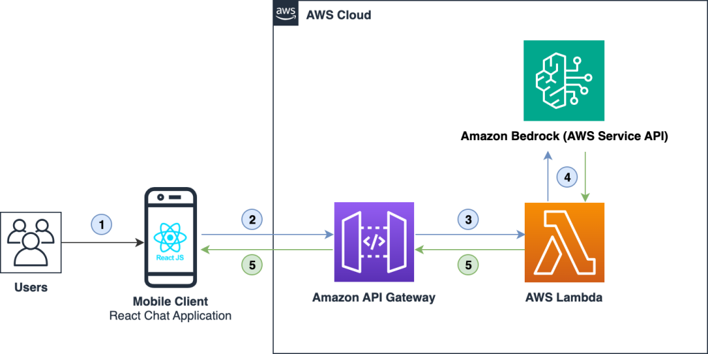
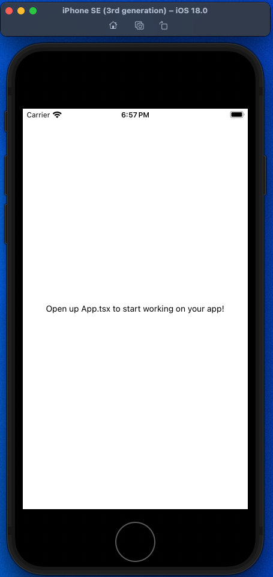

# Add Amazon Bedrock Chat Capabilities to a React Native App

This repo demonstrate how to create a React Native chat application using Amazon Bedrock to build AI-powered chat features.

Below illustrates the architecture and process flow for running a React Native mobile application backend in the AWS Cloud.

1. Users access the application from their mobile devices.
2. The mobile client React chat application interfaces with Amazon API Gateway.
3. Amazon API Gateway interacts with AWS Lambda to post and fetch the data.
4. AWS Lambda interacts with one of the Amazon Bedrock models and returns the generated response in a JSON format.
5. The processed data is then returned to the frontend for display, facilitating content or chat presentation.

### Prerequisites

Before you get started, make sure you have the following installed:

- Create an [AWS Account](https://portal.aws.amazon.com/billing/signup) if you don’t have one. Note that AWS Amplify is part of the [AWS Free Tier](https://aws.amazon.com/amplify/pricing/).
- [Configure your AWS account](https://docs.amplify.aws/react-native/start/account-setup/) to use with Amplify.
- [Node.js](https://nodejs.org/en) v18.17 or later
- [npm](https://www.npmjs.com/) v9 or later
- [git](https://git-scm.com/) v2.14.1 or later
- [Expo CLI](https://docs.expo.dev/more/expo-cli/)
- [Expo Go](https://expo.dev/go) is a sandbox that enables you to quickly experiment with building native Android and iOS apps. It’s the fastest way to get started.

### Issues

The following packages should be updated for best compatibility with the installed expo version:

`typescript@5.6.2 - expected version: ~5.3.3`

Your project may not work correctly until you install the expected versions of the packages.

Run the below command to update typescript to the expected version.

<code>$ npm i typescript@~5.3.3</code>

### Create your application

Run the below command to create an app (Uses [Expo](https://expo.dev)'s TypeScript template).

<code>$ npx create-expo-app amazon_bedrock_expo_chat_app -t expo-template-blank-typescript</code>

### Start your application

Navigate to the root folder of your application and execute the following command to start the application.

<code>
cd amazon_bedrock_expo_chat_app

npm run ios
</code>

When prompted, enter i to open the App in iOS simulator.

`Press i │ open iOS simulator`

Upon successful execution, you will see your new application running in the iOS Simulator, as shown below.

#
